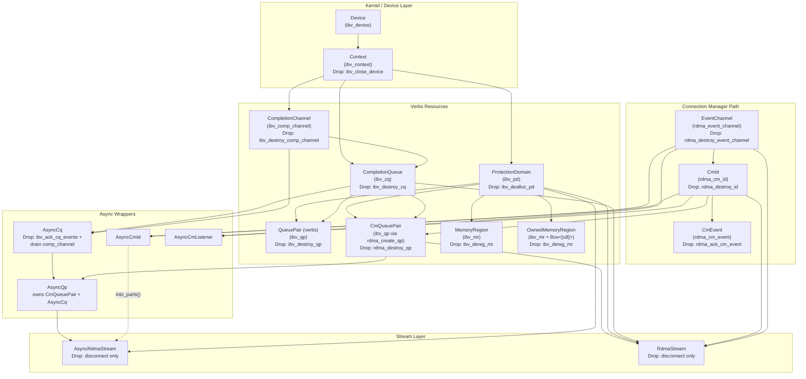
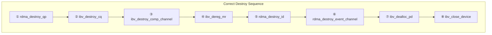
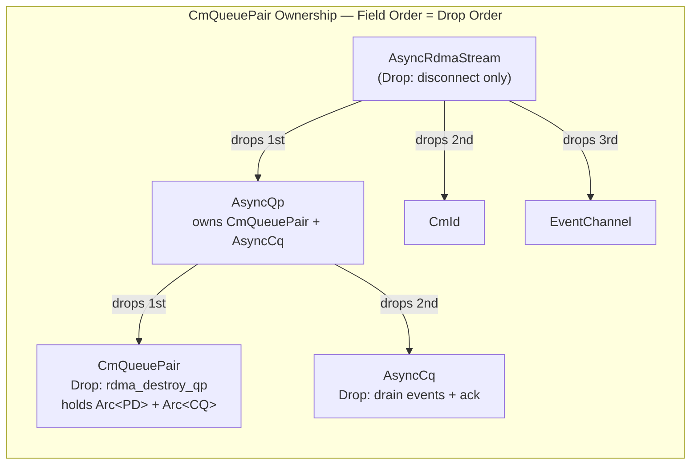

# RDMA Resource Drop Ordering

**Status**: ✅ Resolved — `CmQueuePair` implemented, zero errors  
**Affects**: All CM-managed connections  

## 0. RDMA Resource Dependency Graph

### Full Resource Hierarchy

Every RDMA object depends on other objects that must remain alive for its entire lifetime.
Arrows mean **"depends on / must outlive me"**.



### Required Teardown Order (Numbered)



### Implemented Ownership Model



## 1. Background: The Drop Ordering Problem

RDMA CM-managed resources have a strict kernel-enforced teardown ordering:

```
Required order:
  1. rdma_destroy_qp(cm_id)       — QP must be destroyed first
  2. ibv_destroy_cq               — CQ after QP
  3. ibv_destroy_comp_channel     — CompChannel after CQ
  4. rdma_destroy_id(cm_id)       — CM ID after QP is gone
  5. rdma_destroy_event_channel   — EventChannel last
  6. ibv_dealloc_pd               — PD after everything using it
```

Reference: `man rdma_destroy_id` — *"Users must free any associated QP with the rdma_cm_id before calling this routine."*

Rust's automatic `Drop` runs in **struct field declaration order** (first declared drops first). This means correct field ordering alone can enforce teardown order — if each resource's lifetime dependencies are properly encoded.

## 2. Previous Problem (Now Resolved)

### 2.1 The Unowned QP

`rdma_create_qp` doesn't return a QP — it mutates `cm_id->qp` in place. Our original `CmId::create_qp()` returned `Result<()>`, leaving the QP lifecycle orphaned. Nobody in the safe API owned it; nobody destroyed it.

### 2.2 ManuallyDrop Workaround (Removed)

We temporarily used `ManuallyDrop` wrappers + explicit `Drop` impls with `unsafe` FFI calls to `rdma_destroy_qp`. This worked but leaked unsafe code into Drop impls and made resource dependencies implicit rather than type-system enforced.

## 3. Solution: `CmQueuePair` + Ownership Transfer

### 3.1 Design Principle

`CmId::create_qp()` now returns a `CmQueuePair` that the caller must keep alive.
Ownership follows usage, not creation. The QP moves to whoever does data transfer.

### 3.2 `CmQueuePair` — Safe QP Wrapper for CM-managed QPs

```rust
/// Safe wrapper around an ibv_qp created via rdma_create_qp.
///
/// Owns the QP lifecycle. Drop calls rdma_destroy_qp.
/// Captures Arc references to PD and CQs to prevent premature destruction.
pub struct CmQueuePair {
    qp: *mut ibv_qp,
    cm_id_raw: *mut rdma_cm_id,
    _pd: Arc<ProtectionDomain>,
    _send_cq: Option<Arc<CompletionQueue>>,
    _recv_cq: Option<Arc<CompletionQueue>>,
}

impl Drop for CmQueuePair {
    fn drop(&mut self) {
        unsafe { rdma_destroy_qp(self.cm_id_raw) };
    }
}
```

**Key**: PD and CQs are captured as `Arc` clones — they cannot be freed while the QP references them.

### 3.3 `CmId::create_qp` Returns Owned QP

```rust
impl CmId {
    pub fn create_qp_with_cq(
        &self, pd: &Arc<ProtectionDomain>, init_attr: &QpInitAttr,
        send_cq: Option<&Arc<CompletionQueue>>,
        recv_cq: Option<&Arc<CompletionQueue>>,
    ) -> Result<CmQueuePair> {
        // ... call rdma_create_qp ...
        Ok(CmQueuePair {
            qp: self.qp_raw(),
            cm_id_raw: self.as_raw(),
            _pd: Arc::clone(pd),
            _send_cq: send_cq.map(Arc::clone),
            _recv_cq: recv_cq.map(Arc::clone),
        })
    }
}
```

### 3.4 `AsyncQp` Owns QP + CQ — Correct Drop Order via Field Declaration

```rust
pub struct AsyncQp {
    qp: CmQueuePair,        // drops 1st → rdma_destroy_qp
    async_cq: AsyncCq,       // drops 2nd → ibv_destroy_cq + ibv_destroy_comp_channel
}

impl AsyncQp {
    pub fn new(qp: CmQueuePair, async_cq: AsyncCq) -> Self {  // safe!
        Self { qp, async_cq }
    }
}
// No custom Drop needed — field declaration order = teardown order.
```

### 3.5 Streams Use Plain Field Order — No ManuallyDrop

```rust
pub struct AsyncRdmaStream {
    aqp: AsyncQp,                  // drops 1st: QP → CQ → CompChannel
    cm_id: CmId,                   // drops 2nd: rdma_destroy_id
    _event_channel: EventChannel,  // drops 3rd: rdma_destroy_event_channel
    _pd: Arc<ProtectionDomain>,
    // ... buffers, poll state ...
}

impl Drop for AsyncRdmaStream {
    fn drop(&mut self) {
        // Only need disconnect — field drop order handles everything else
        let _ = self.cm_id.disconnect();
    }
}
```

No `ManuallyDrop`. No `unsafe` FFI in Drop. No `rdma_destroy_qp` call.

### 3.6 Why This Works

The ownership graph is a clean DAG with no cross-struct dependencies:

```
AsyncRdmaStream
  ├── aqp: AsyncQp           (field drops 1st)
  │     ├── qp: CmQueuePair  (sub-field drops 1st → rdma_destroy_qp)
  │     │     ├── _pd: Arc<PD>       (prevents PD drop while QP alive)
  │     │     ├── _send_cq: Arc<CQ>  (prevents CQ drop while QP alive)
  │     │     └── _recv_cq: Arc<CQ>  
  │     └── async_cq: AsyncCq (sub-field drops 2nd → ibv_destroy_cq)
  ├── cm_id: CmId             (field drops 2nd → rdma_destroy_id)
  └── _event_channel           (field drops 3rd → rdma_destroy_event_channel)
```

Every resource is destroyed after everything that depends on it. All enforced by:
- **Field declaration order** (Rust drops first-declared first)
- **Arc refcounting** (PD/CQ can't drop while QP's Arc refs exist)
- **No shared mutable state** (QP is exclusively owned, not Arc'd)

### 3.7 Arc<CQ> Shared Ownership Pitfall

When `CmQueuePair` and `AsyncCq` both hold `Arc<CQ>` refs to the same CQ, **drop
order between siblings matters**. `CmQueuePair` must drop before `AsyncCq` so that
the Arc refcount on the CQ reaches 0 inside `AsyncCq::drop`, allowing
`ibv_destroy_cq` to run before `ibv_destroy_comp_channel`.

Inside `AsyncQp` this is correct (qp field before async_cq field). When using
`CmQueuePair` and `AsyncCq` separately (e.g., in tests), explicitly drop the
`CmQueuePair` first.

### 3.8 AsyncCq Drain-on-Drop

`AsyncCq::Drop` drains any pending events from the `CompletionChannel` fd before
acking and destroying the CQ. This handles a race condition: if `req_notify` armed
the CQ but `poll()` returned early (completions found before waiting on fd), an
unconsumed event remains on the comp_channel. Without draining, `ibv_destroy_comp_channel`
fails with EBUSY because the kernel sees pending unread events.

```rust
impl Drop for AsyncCq {
    fn drop(&mut self) {
        // Drain pending events from arm-before-poll races
        loop {
            match self.channel.get_cq_event() {
                Ok(_) => { self.unacked_events.fetch_add(1, ...); }
                Err(_) => break,
            }
        }
        // Ack all events before CQ destruction
        let unacked = self.unacked_events.load(...);
        if unacked > 0 {
            unsafe { ibv_ack_cq_events(self.cq.as_raw(), unacked) };
        }
    }
}
```

## 4. Summary

| Aspect | Before (ManuallyDrop) | After (CmQueuePair) |
|--------|----------------------|---------------------|
| QP ownership | Unowned raw pointer | `CmQueuePair` struct with Drop |
| PD/CQ lifetime | Not enforced | Arc captured in `CmQueuePair` |
| Teardown safety | `ManuallyDrop` + `unsafe` FFI in Drop | Field declaration order |
| User-facing API | Must call `unsafe rdma_destroy_qp` | Automatic via Drop |
| Composability | Error-prone manual ordering | Type-system enforced |
| `AsyncQp::new` | `unsafe fn new(*mut ibv_qp, ...)` | `fn new(CmQueuePair, AsyncCq)` — safe |
| Error count | 70 → 6 (ManuallyDrop) | **0** |
| Stream Drop impl | `unsafe` FFI + ManuallyDrop cascade | `disconnect()` only |
