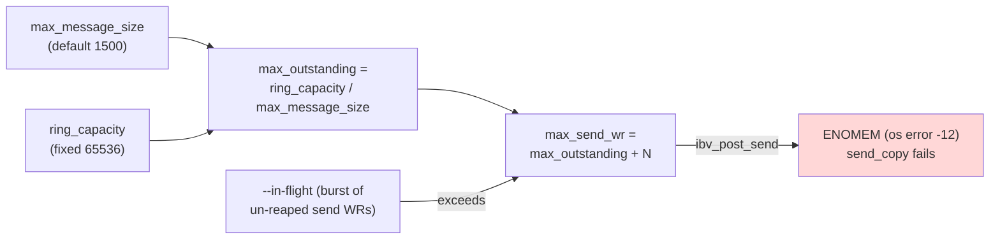

# Ring Transports: Send-Queue Exhaustion (ENOMEM) at High In-Flight

## Summary

The ring transports (`CreditRingTransport`, `ReadRingTransport`) size their QP
**send queue depth from the ring slot count**, not from the intended pipelining
depth. When an application keeps more requests in flight than the send queue can
hold, `ibv_post_send` returns `ENOMEM` and the connection fails. This surfaced
in the direct echo benchmark (`--mode echo`) as every connection erroring with
zero completed requests at high `--in-flight`.

## Status

**Fixed.** Two changes:

1. `send_copy` treats a full send queue as backpressure (`Ok(0)`) instead of a
   fatal `Err`, so a connection never dies at high in-flight — every combination
   completes with **zero errors**.
2. The in-flight message budget is decoupled from `max_message_size` via a new
   `max_in_flight` ring-config option, which sizes the send queue, the
   receiver's doorbell recv queue, and the CQs together (clamped to the device's
   `max_qp_wr`/`max_cqe`). Setting it lets deep pipelines of small messages run
   at full speed **without** shrinking `max_message_size`. Measured (8×8, 64 B,
   default `max_message_size=1500`): read-ring in-flight 64 goes from ~586 req/s
   (p50 0.66 s, RNR-limited) to **4.1M req/s, 0 errors, p50 100 µs** with
   `max_in_flight=128`; credit-ring from ~407 req/s to **1.0M req/s, 0 errors**.

`max_in_flight` defaults to `None` (derive `ring_capacity / max_message_size`),
so existing callers are unchanged. Do not push in-flight past `max_in_flight`
(or the derived default) — beyond it the transport still backpressures safely
but throughput degrades toward the doorbell-saturation / RNR boundary.

## Symptom

`--mode echo` over a ring transport at high `--in-flight` (e.g. 64) returns
`total_requests: 0, errors: <connections>`. With `RUST_LOG=rdma_io_bench=trace`
the client logs:

```
TRACE rdma_io_bench::echo: echo send_copy failed error=ibverbs error: Unknown error -12 (os error -12)
```

`os error -12` is `ENOMEM`, which `ibv_post_send` returns when the send work
queue is full — not an out-of-memory condition in the usual sense.

## Root Cause

Both ring transports derive the QP send-queue depth from the ring geometry:

```
max_outstanding = ring_capacity / max_message_size
max_send_wr     = max_outstanding + N     // read-ring: +3, credit-ring: +2
```

`max_send_wr` is the hard cap on **un-completed send work requests**. The echo
client keeps up to `--in-flight` requests outstanding and, in its fill phase,
posts a burst of sends before reaping send completions. Each `send_copy` posts
at least one RDMA-Write WR, and `read-ring` posts additional WRs (a padding
Write on ring wrap, and an RDMA-Read for flow control). When the number of
in-flight send WRs approaches `max_send_wr`, the next `ibv_post_send` returns
`ENOMEM` and `send_copy` fails.

With the default `max_message_size = 1500` and `ring_capacity = 65536`:

```
max_outstanding = 65536 / 1500 ≈ 43   →   max_send_wr ≈ 45–46
```

So the send queue holds only ~45 WRs regardless of how much pipelining the
caller asks for — the transport advertises a ring but cannot absorb a deep
request pipeline.



The coupling is the bug: **send-queue depth should track the desired in-flight
depth, not the ring's byte capacity divided by the max message size.**

## Reproduction

Echo benchmark, 8×8, 64 B payload, `--mw-fallback`. `ring_max_msg` sets
`max_message_size`; the resulting send-queue depth is shown:

| transport | ring_max_msg | slots | ~max_send_wr | in-flight 64 |
|---|---|---|---|---|
| credit-ring | 1500 | 43 | 45 | ❌ ENOMEM |
| credit-ring | 256 | 256 | 258 | ✅ 993k req/s |
| read-ring | 1500 | 43 | 46 | ❌ ENOMEM |
| read-ring | 256 | 256 | 259 | ❌ ENOMEM |
| read-ring | 128 | 512 | 515 | ✅ 4.67M req/s |
| read-ring | 64 | 1024 | 1027 | ✅ 4.36M req/s |

`read-ring` needs a deeper send queue than `credit-ring` at the same in-flight
because it also posts padding Writes (on ring wrap) and RDMA-Read WRs (flow
control) onto the same send queue, so more WRs compete for `max_send_wr` slots.

## Why the ring can't simply be made bigger

`ring_capacity` is **hard-capped at 65536 bytes** by the RDMA-Write immediate
encoding, which packs the ring offset and length into 32 bits:
`imm = (offset << 16) | length`. Both fields are 16-bit, so the offset (and
therefore the ring) cannot exceed 65535. Raising `max_outstanding` is only
possible by lowering `max_message_size`.

## Fix options

1. **Back-pressure instead of failing (implemented).** `send_copy` now checks the
   send-queue occupancy (`send_in_flight`, plus a pending RDMA-Read for
   read-ring) against the queue depth before posting, drains completed sends
   non-blockingly, and returns `Ok(0)` when the queue is full — the same
   "cannot accept right now" signal `SendRecvTransport` uses when its send
   buffers are busy. Callers already retry on `Ok(0)` after
   `poll_send_completion`, so the connection is throttled to the send-queue
   depth instead of erroring. credit-ring additionally defers its cumulative
   credit `Send` when the queue is full and flushes it once a slot frees
   (credit updates carry an absolute count, so a deferred update subsumes
   skipped ones). This is the contract-conforming fix and matches send-recv.
2. **Decouple send-queue and doorbell depth from ring geometry (implemented).**
   `ReadRingConfig`/`CreditRingConfig` gained a `max_in_flight: Option<usize>`
   field (builder: `with_max_in_flight`). `effective_max_outstanding` in
   `transport_common.rs` uses it as the slot count when set (else derives
   `ring_capacity / max_message_size`), sizing `max_send_wr`, the doorbell recv
   queue, the CQs, and the slot tables together, clamped to the device's
   `max_qp_wr`/`max_cqe`. This keeps sender send-queue and receiver doorbells
   consistent, so deep small-message pipelines run without RNR stalls. Both
   sides must use the same value.
3. **Client-side cap.** Consumers can bound in-flight to the transport's
   advertised capacity and reap send completions before each post — but the
   transport should expose that capacity.

## Workaround

For small-message workloads, lower `max_message_size` so the derived
send-queue depth exceeds the desired in-flight depth. In the benchmark:

```bash
just run-bench mode=echo transport=read-ring in_flight=64 \
    payload=64 mw_fallback=true ring_max_msg=128    # SQ ≈ 515, passes
```

Payloads larger than `max_message_size` are truncated to one message, so this
trades maximum message size for pipelining depth.

## Related

- [credit-ring-ooo-overwrite.md](credit-ring-ooo-overwrite.md) — a separate
  ring flow-control sizing bug.
- [../design/EchoBenchmark.md](../design/EchoBenchmark.md) — the direct echo
  benchmark that exposed this via its in-flight sweep.
- [../design/TonicRdmaVsTcpPerformance.md](../design/TonicRdmaVsTcpPerformance.md)
  — ring transport behavior at larger payloads.
