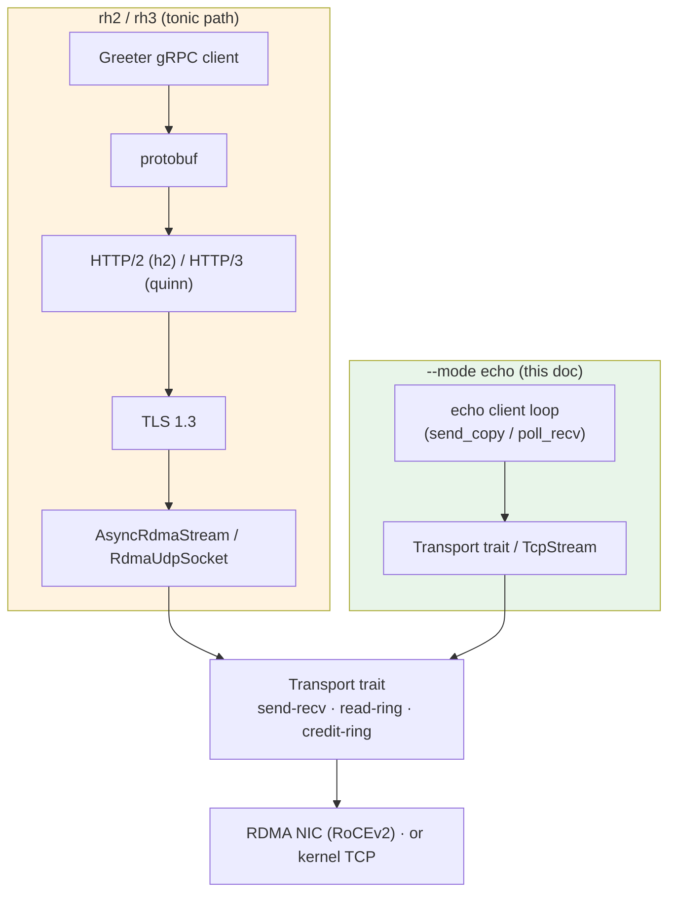
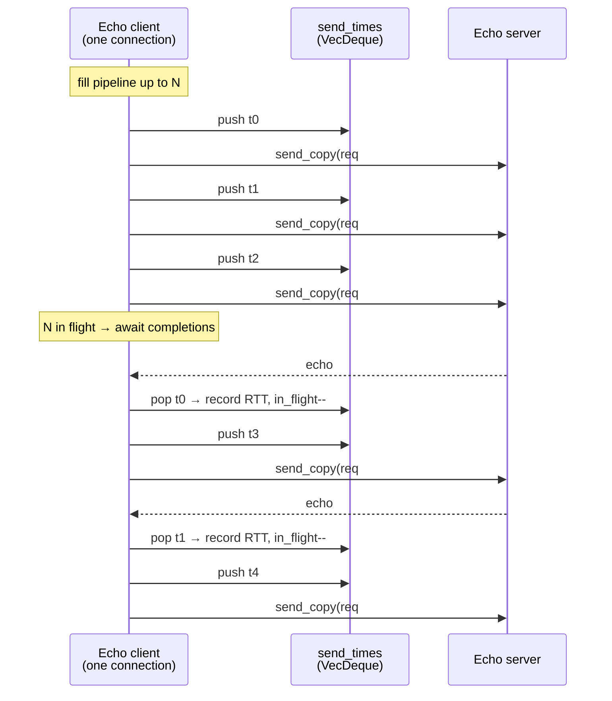
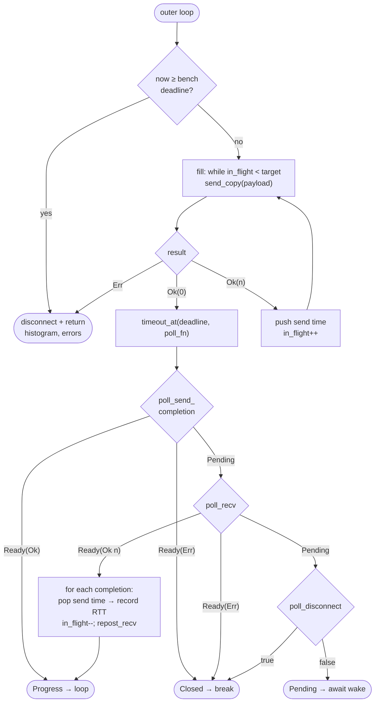
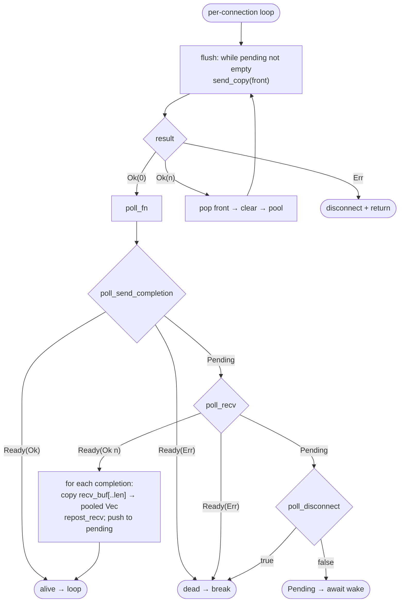
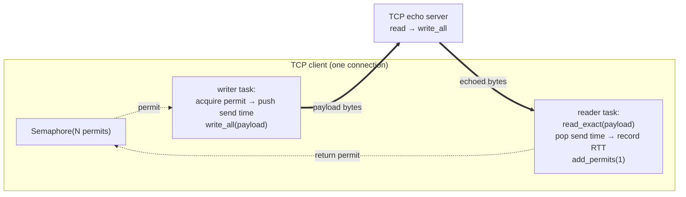

# Direct Transport Echo Benchmark (`--mode echo`)

**Status**: ✅ Implemented — [`tests/rdma-io-bench/src/echo.rs`](../../tests/rdma-io-bench/src/echo.rs)
**Purpose**: Measure raw transport request/response performance without the tonic/gRPC stack.

## 1. Motivation

The `rh2` and `rh3` benchmark modes drive gRPC over RDMA, stacking four layers on
top of the transport:

- **TLS 1.3** (encrypt/decrypt + record framing)
- **HTTP/2** (or QUIC for `rh3`) — `h2`'s `FramedWrite` coalesces small frames
  into one buffer (`CHAIN_THRESHOLD`), so the transport never sees the write
  pattern the application produced
- **protobuf** serialization
- **hyper** reactor wakeups + stream bookkeeping

Those layers make transport-level tuning hard to observe: vectored writes and a
native `tokio` I/O path both measured *flat* through `rh2` precisely because h2
pre-coalesces (see [TonicRdmaVsTcpPerformance.md](TonicRdmaVsTcpPerformance.md)).

`--mode echo` removes all four. Each request is **one `send_copy`**, each
response is **one recv completion**, so latency and throughput map 1:1 to
transport behaviour. A matched raw-TCP echo (`--transport tcp`) provides an
apples-to-apples kernel baseline, and `--in-flight N` controls how many requests
each connection keeps outstanding so pipelining depth can be swept directly.

## 2. Where it sits in the stack

`echo` is generic over the [`Transport`](../../rdma-io/src/transport.rs) trait, so
one implementation covers all three RDMA transports plus a raw-TCP baseline.



The tonic path traverses five layers before reaching the transport; the echo
path calls the transport directly.

## 3. RDMA raw-transport echo

### 3.1 Request/response pipeline

Each connection runs a single task that owns the transport (the `Transport`
trait is `&mut self` / not split), keeping up to `--in-flight N` requests
outstanding. RC queue pairs preserve ordering and the echo server replies in
receive order, so responses match requests **FIFO** via a `VecDeque<Instant>` of
send timestamps.



### 3.2 Client poll loop

The task alternates between **filling** the pipeline (synchronous `send_copy`
until the depth target is hit or the transport returns `Ok(0)`) and **awaiting
progress** via a `poll_fn` bounded by the benchmark deadline. A single poll
checks three sources in priority order:



Reaping a send completion first frees a send buffer so the next `fill` can post
more. `AsyncCq::poll_completions` only returns `Ready(Ok(n))` with `n ≥ 1`, so a
send-completion wake is always real progress (no busy-loop). Latency is recorded
only when the request's send time is at or after the warmup deadline.

### 3.3 Server echo loop

The server accepts connections until shutdown and spawns one echo loop per
connection. Because `recv_buf(idx)` borrows the transport immutably while
`send_copy` needs `&mut`, each message is **copied into an owned buffer** (from a
pooled free-list) so the recv buffer can be reposted immediately; the copy is
then queued and echoed back with back-pressure handling.



### 3.4 Buffer sizing

The raw path lets the benchmark size the transport to the workload — something
the tonic path's fixed `::stream()`/`::datagram()` configs don't expose.

| Side | send-recv config | Notes |
|---|---|---|
| Client | `buf_size = payload.max(64)`, `num_send_bufs = num_recv_bufs = in_flight + 2` | Sized so `N` requests fit in flight |
| Server | `buf_size = 64 KiB`, `num_send_bufs = num_recv_bufs = 64` | Generous fixed sizing; handles pipelined clients |
| Rings | `::datagram()` (`max_message_size = 1500`) + `--mw-fallback` | Payloads > 1500 B are truncated to one message (warned) — do **not** raise `max_message_size` (latent ring bug, see perf doc) |

## 4. Raw-TCP baseline (`--transport tcp`)

TCP is a byte stream, so pipelining needs the connection split into independent
reader/writer halves coordinated by a semaphore. The server echoes bytes
verbatim; since every request is exactly `payload` bytes, each `read_exact` of
`payload` bytes is one response.



The semaphore bounds outstanding requests to `N`; the reader returns a permit
per response, and closing the semaphore stops the writer at the deadline.

## 5. Metrics and reporting

Both paths reuse [`BenchMetrics`](../../tests/rdma-io-bench/src/metrics.rs) /
[`BenchResult`](../../tests/rdma-io-bench/src/report.rs). Each connection records
into its own `hdrhistogram`; the per-connection histograms are merged at the end
into throughput + p50/p95/p99/p999/min/max/avg, reported with `mode = "echo"`
and `transport = send-recv | read-ring | credit-ring | tcp`.

For `--mode echo`, the client additionally samples its own CPU and memory over
the measured window (see §8) and reports `cpu_seconds`, `cpu_us_per_op`, and
`peak_rss_kb` alongside the latency stats.

## 6. Running

```bash
# RDMA send-recv echo, 8 connections, 16 requests in flight each, 1 KiB payload
rdma-bench-server --mode echo --transport send-recv --bind 0.0.0.0:50051
rdma-bench-client --mode echo --transport send-recv \
    --connect <server-ip>:50051 --connections 8 --in-flight 16 --payload 1024

# TCP baseline (same knobs)
rdma-bench-server --mode echo --transport tcp --bind 0.0.0.0:50051
rdma-bench-client --mode echo --transport tcp \
    --connect <server-ip>:50051 --connections 8 --in-flight 16 --payload 1024
```

Transports: `send-recv`, `read-ring`, `credit-ring` (raw RDMA) and `tcp`
(baseline). Add `--mw-fallback` for the ring transports on NICs that report
`max_mw = 0` (e.g. Azure MANA).

**Ring queue sizing.** By default a ring sizes its send/doorbell/CQ queues for
`ring_capacity / max_message_size` in-flight messages (~43 at the 1500 B
default), which caps deep pipelines of small messages. Two knobs raise it:

- `--ring-max-inflight N` — size the queues for `N` in-flight messages directly
  (preferred; keeps the message size). Must match on client and server.
- `--ring-max-msg B` — lower the max message size (also raises the slot count),
  at the cost of truncating payloads larger than `B`.

```bash
# read-ring, 64 in flight per connection, queues sized for 128
rdma-bench-server --mode echo --transport read-ring --mw-fallback --ring-max-inflight 128 --bind 0.0.0.0:50051
rdma-bench-client --mode echo --transport read-ring --mw-fallback --ring-max-inflight 128 \
    --connect <server-ip>:50051 --connections 8 --in-flight 64 --payload 64
```

### Sweeping the matrix on the VMs

The outer repo drives the two-VM sweep over Ansible (mirrors `bench-matrix`):

```bash
just deploy-bench                                   # build + push binaries/certs
just echo-matrix                                    # transports x in-flight, 8x8
just echo-matrix "send-recv tcp" "1 8 32" 8 10 1024 # subset + 1 KiB payload
# full sweep with ring queues sized for deep pipelines (positional args:
# transports in_flights cpus duration payload mw_fallback settle reboot_between ring_max_inflight)
just echo-matrix "send-recv read-ring credit-ring tcp" "1 4 16 64" 8 8 64 true 10 false 128
just bench-report                                   # merge JSON → Markdown + charts
```

`echo-matrix` iterates `transports x in_flights`, invoking the shared
`bench_run.yml` playbook with `bench_mode=echo` and `bench_in_flight=N`. The
trailing `ring_max_inflight` arg (default `0` = derive from `ring_capacity /
max_message_size`) sizes the ring queues so the ring transports sustain the
deeper in-flight values without back-pressuring early (see §7). Results land in
`build/bench/bench-echo-<transport>-<conns>conn-<threads>thr-<N>if.json`;
`in_flight` is carried in the result JSON, so `bench-report` keeps each
`echo/<transport>@if<N>` point distinct. `settle`/`reboot_between` behave as in
`bench-matrix` (idle pause vs NIC power-cycle between combos).

### Debugging a failed run

Pass `save_logs=true` (optionally with `rust_log=...`) to keep the server and
client `RUST_LOG` output on the controller for a single run:

```bash
just run-bench mode=echo transport=read-ring in_flight=64 payload=64 \
    mw_fallback=true rust_log="rdma_io_bench=trace,rdma_io=debug" save_logs=true
# → build/bench/client-echo-read-ring-64if.log, build/bench/server-read-ring-64if.log
```

## 7. Finding: ring in-flight ceiling (fixed)

The in-flight sweep surfaced a real ring-transport bug: past a per-transport
in-flight ceiling the rings failed with an `ENOMEM` (`os error -12`) from
`ibv_post_send`, because their QP **send-queue and doorbell depths were coupled
to the ring slot count** (`ring_capacity / max_message_size`), so a deep request
pipeline overran the queues. This is now fixed two ways: `send_copy` treats a
full send queue as back-pressure (`Ok(0)`) instead of a fatal error, and a
`max_in_flight` config option (`--ring-max-inflight`) sizes the send/doorbell/CQ
queues for the intended pipeline depth independently of `max_message_size`. See
[../bugs/ring-send-queue-exhaustion.md](../bugs/ring-send-queue-exhaustion.md)
for the full analysis, reproduction, and fix.

With the queues sized (`ring_max_inflight=128`), every transport scales cleanly
to in-flight 64 with **zero errors** (8×8, 64 B payload, req/s):

| in-flight | send-recv | read-ring | credit-ring | tcp |
|---|---|---|---|---|
| 1  | 99.7k | 100.4k | 100.2k | 92.7k |
| 4  | 419k  | 362k   | 375k   | 334k |
| 16 | 1.30M | 1.34M  | 1.26M  | 1.08M |
| 64 | 3.71M | **4.32M** | 1.05M | 1.80M |

Takeaways: at in-flight 1 (the request/response regime the tonic `rh2` path runs
in) all transports are within ~10% (~95–100k) — ~2.5× the `rh2` gRPC number,
showing the TLS + h2 + protobuf + hyper stack's overhead. Pipelining is the
dominant lever; RDMA `send-recv`/`read-ring` reach ~2× TCP at depth with far
better tail latency, and `read-ring` leads at in-flight 64. `credit-ring` trails
at depth because its credit round-trips add latency.

## 8. Finding: CPU efficiency and depth scaling

The 8×8 sweep above is CPU-*constrained* (8 cores), which is exactly where
RDMA's lower per-op cost converts into higher throughput. To separate *rate*
from *cost*, the echo client also measures its own resource use: a sampler task
snapshots `/proc/self/stat` (user+system CPU, summed across all threads) at the
warm-up and benchmark deadlines — so the delta covers **only the measured
window**, excluding connection setup and warm-up — plus the `VmHWM` peak RSS.
These surface in the result JSON as `cpu_seconds`, `cpu_us_per_op`, and
`peak_rss_kb`, and as `CPU/op µs` / `Peak RSS MB` columns in `bench-report`.

> Why in-process, not `/usr/bin/time`? Whole-process CPU is dominated by the
> long ring connection setup (~60–80 s at 64 connections), which would swamp the
> ~10 s measured window. Sampling across the window is the accurate per-op cost.

**How the metrics are derived** (all from the same client-side `cpu_seconds` =
user + kernel CPU-time consumed by every thread during the window):

- **`cores busy`** (the tables below) = `cpu_seconds / duration_secs`. It is the
  *average* number of fully-saturated cores the client used — e.g. 94 CPU-seconds
  over a 10 s window = 9.4 cores. It is a time-average (not a peak) of
  compute-equivalent cores spread by the scheduler across the 64 vCPUs, not
  pinned cores. The ceiling is 64. It counts **user + kernel** time, so TCP's
  figure is inflated by in-kernel `stime` (syscalls, softirq, TCP/IP stack)
  while RDMA is almost all user-space `utime` (kernel-bypass).
- **`CPU/op µs`** (`cpu_us_per_op`) = `cpu_seconds / total_requests × 1e6` — the
  same CPU-time divided by work done instead of by wall-time.
- Both are **client-side only**; the server does comparable echo work but is not
  sampled.

### CPU cost per operation (64×64, in-flight 64, 64 B)

Given a large core budget (64 vCPUs), TCP can brute-force *higher* raw
throughput — but at a very different cost:

| transport | throughput | **CPU/op** | cores busy | peak RSS | p50 | p99 |
|---|---:|---:|---:|---:|---:|---:|
| **read-ring** (RDMA) | 4.75M | **1.21 µs** | ~5.8 | 34.8 MB | 217 µs | 1096 µs |
| **send-recv** (RDMA) | 4.40M | 1.30 µs | ~5.7 | 24.4 MB | 243 µs | 1408 µs |
| tcp (kernel) | 6.75M | 5.37 µs | ~36.3 | 17.9 MB | 279 µs | 1362 µs |
| credit-ring (RDMA) | 1.01M | 3.93 µs | ~4.0 | 34.3 MB | 4111 µs | 4463 µs |

**RDMA is ~4.4× more CPU-efficient per operation** (read-ring 1.21 µs vs TCP
5.37 µs). TCP's higher rps costs ~36 cores because it is fully CPU-bound in the
kernel stack; the RDMA rings hit 4.4–4.75M on only ~6 cores — they are
NIC/completion-bound, not CPU-bound, and leave headroom. RDMA also uses ~2× the
RSS (registered buffers + MRs); `send-recv` is lighter than the rings.

### Depth scaling: read-ring in-flight sweep

The 4.75M figure is not a hardware ceiling — 64×64 uses shallow 64-deep
pipelines. Because the limiter is per-message overhead (doorbells + completion
notifications), *deeper per-connection pipelines* amortize it. Sweeping
`--in-flight` (with `--ring-max-inflight` sized to match) on read-ring:

| conns × depth | offered | throughput | CPU/op | cores | p50 | p99 |
|---|---:|---:|---:|---:|---:|---:|
| 16 × 64  | 1024  | 4.13M | 1.368 µs | 5.7 | 170 µs | 716 µs |
| 16 × 256 | 4096  | 5.92M | 1.125 µs | 6.7 | 244 µs | 1198 µs |
| **16 × 512** | 8192 | **6.58M** | **0.993 µs** | 6.5 | 419 µs | 1771 µs |
| 32 × 512 | 16384 | **6.75M** | 1.051 µs | 7.1 | 462 µs | 1942 µs |
| 16 × 1024 | 16384 | 4.39M | 0.939 µs | 4.1 | 784 µs | 2723 µs |
| 16 × 2048 | 32768 | 4.06M | 0.871 µs | 3.5 | 1178 µs | 4975 µs |

At 32 × 512, **read-ring reaches 6.75M req/s using ~7 cores** — and it gets
there because:

- **CPU/op *drops* with depth** (1.37 → 0.99 µs): deeper pipelines reap more
  completions per wakeup, amortizing the doorbell/notification cost. Fewer-but-
  deeper beats more-but-shallow (16 × 512 at 6.5 cores > 32 × 256 > 64 × 64).
- read-ring peaks at **~6.75M using only ~7 of the 64 cores** — it is neither
  CPU-bound nor NIC-bound (TCP pushes the same NIC to 8.4M pps, see below). The
  ceiling is read-ring's own **per-message doorbell/completion overhead**; it
  leaves ~57 cores idle and still cannot go faster.

**There is an optimum depth (~512 here), not "more is better".** Past that knee,
deeper pipelines *collapse* throughput (6.58M → 4.39M → 4.06M at 16 × 512
→ 1024 → 2048) even though CPU/op keeps falling: cores busy drop (6.5 → 3.5) and
latency balloons (p50 419 → 1178 µs). The pipeline is over-queued — completions
arrive in large bursts with idle gaps and requests pile up in the doorbell/CQ
queues rather than being serviced, so the system waits instead of working. It is
an inverted-U: too shallow underfills the pipe, too deep over-queues and stalls.

**read-ring hard-caps at ~6.8M rps / ~9 cores — no parameter breaks it.** A
reboot-gated sweep over connection count at the good depth confirms the ceiling
is architectural, not tunable:

| conns × depth | offered | throughput | cores | CPU/op | p50 |
|---|---:|---:|---:|---:|---:|
| **48 × 512** | 24576 | **6.83M** | 9.4 | 1.380 µs | 651 µs |
| 32 × 512 | 16384 | 6.75M | 7.1 | 1.051 µs | 462 µs |
| 64 × 512 | 32768 | 6.58M | 6.0 | 0.913 µs | 396 µs |
| 64 × 256 | 16384 | 5.49M | 5.7 | 1.032 µs | 227 µs |

Cores busy stay pinned at **~6–9 across *every* config** (16–64 connections,
depth 64–2048); more connections do not engage more cores and 64 × 512 even
regresses. The NIC sustains 8.4M pps (TCP) and ~55 cores sit idle, yet read-ring
cannot go faster: its per-message completion/doorbell path serializes and will
not parallelize past ~9 cores. **Pushing past ~6.8M requires transport code
changes (unsignaled/batched sends, doorbell/completion batching), not knobs.**
Best deployable configs: **48 × 512** for peak throughput, or **32 × 512** for a
better latency/throughput balance (p50 462 vs 651 µs).

### TCP scales the other way — with connections (cores)

TCP is **CPU-bound in the kernel stack**, so it scales with *connection count*
(more threads → more cores), not pipeline depth. On the 64-vCPU VM:

| tcp config | offered | throughput | CPU/op | cores | p50 | p99 |
|---|---:|---:|---:|---:|---:|---:|
| 64 × 64   | 4096  | 6.75M | 5.37 µs | 36.3 | 279 µs | 1362 µs |
| 128 × 64  | 8192  | 7.74M | 6.36 µs | 49.2 | 406 µs | 2517 µs |
| 128 × 128 | 16384 | 8.13M | 6.36 µs | 51.7 | 896 µs | 4563 µs |
| **256 × 64** | 16384 | **8.42M** | 6.38 µs | 53.7 | 575 µs | 4079 µs |
| 16 × 512  | 8192  | 2.78M | 4.41 µs | 12.3 | 744 µs | 3851 µs |

TCP tops out at **~8.42M rps at ~54/64 cores** (the last ~10 cores go to
softirq/network-stack contention, not useful work). Note TCP does *not* benefit
from deep pipelines on few connections (16 × 512 = only 2.78M) — each TCP
connection is a serial byte stream, so parallelism comes from *more connections*.

### Which is faster?

| | peak throughput | CPU/op | cores at peak |
|---|---:|---:|---:|
| **read-ring** (RDMA) | 6.75M | **1.05 µs** | **~7** |
| tcp (kernel) | **8.42M** | 6.38 µs | ~54 |

TCP wins **absolute** throughput (~+25%) — but only by burning **~7.5× the cores
and ~6× the CPU per op**. read-ring delivers ~80% of TCP's peak while leaving
~57 cores free for the actual application. On a box dedicated to moving bytes,
TCP's brute force wins the headline number; whenever the CPU is needed for real
work, RDMA's efficiency wins decisively. The earlier notion of a shared "~6.7M
NIC wall" was an artifact of comparing read-ring's transport ceiling against a
single 64×64 TCP point — the NIC itself sustains ≥8.4M pps.

The trade-off within each transport is latency: throughput-via-depth (RDMA) or
throughput-via-connections (TCP) both raise queueing delay. By Little's Law the
mean in-flight `N = throughput × latency`, so pushing `N` higher buys rps at the
cost of time-in-system. **Guidance: for RDMA rings, scale in-flight *depth per
connection* up to ~the knee (~512 here) — deeper over-queues and hurts; for TCP,
scale *connection/thread count* toward the core budget. Keep depth/conns modest
when latency matters.** Pushing read-ring past its ~6.75M ceiling needs transport
changes (unsignaled/batched sends, doorbell batching), not a config knob.


