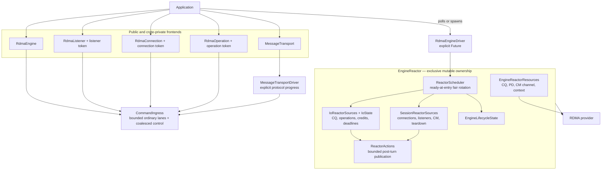

# V2 RDMA Engine and Message Driver

## Overview

The v2 runtime uses one application-owned `RdmaEngineDriver` to advance a
single `EngineReactor`. Public engine, listener, connection, and operation
handles contain stable identities, bounded command admission, and
resource-free result observers; they do not own a second mutable provider
runtime. The library creates no hidden task or thread
([engine/mod.rs:261-340](../../rdma-io/src/v2/engine/mod.rs#L261-L340),
[driver/mod.rs:143-246](../../rdma-io/src/v2/engine/driver/mod.rs#L143-L246),
[reactor/mod.rs:35-82](../../rdma-io/src/v2/engine/reactor/mod.rs#L35-L82)).

V1 remains a separate API. Message transport keeps its own explicit
`MessageTransportDriver` for HELLO, DATA/CREDIT, receive reposting, and
message-level fairness. That protocol driver submits provider work through the
engine command boundary; it is not an alternate engine provider owner.



## Explicit Progress Contract

`RdmaEngineBuilder::build()` returns an engine frontend and one unspawned
driver:

```text
Result<(RdmaEngine, RdmaEngineDriver)>
```

Applications must poll or spawn that driver. Withholding it prevents command,
CM, CQ, reclamation, and shutdown progress. The driver future performs runtime
preflight, calls the sole production `EngineReactor::turn`, publishes the
returned action batch, and applies the register-and-recheck suspension protocol
([driver/mod.rs:143-236](../../rdma-io/src/v2/engine/driver/mod.rs#L143-L236),
[reactor/mod.rs:288-674](../../rdma-io/src/v2/engine/reactor/mod.rs#L288-L674)).

A typical low-level client is:

```rust,no_run
use rdma_io::v2::*;

async fn run() -> Result<()> {
    let (engine, driver) = RdmaEngineBuilder::new("rxe0").build()?;
    let driver_task = tokio::spawn(driver);

    let connection = engine.connect("192.0.2.1:7471".parse().unwrap()).await?;
    let mut mr = connection.register_memory(1024, AccessIntent::LocalOnly)?;
    mr.as_mut_slice()[..5].copy_from_slice(b"hello");
    let (completion, mr) = connection.send(mr, Some((0, 5))).await;
    completion?;
    drop(mr);

    connection.close().await?;
    engine.shutdown().await?;
    driver_task.await.expect("engine driver panicked")?;
    Ok(())
}
```

Readiness mode is the default and requires an active Tokio I/O runtime during
construction. Polling mode creates no CQ readiness adapter, but polling still
requires Tokio time support before lifecycle deadlines can be armed
([engine/config.rs:26-42](../../rdma-io/src/v2/engine/config.rs#L26-L42),
[engine/mod.rs:118-258](../../rdma-io/src/v2/engine/mod.rs#L118-L258)).

## Single-Owner Architecture

### Reactor-owned state

`RdmaEngineDriver` owns one `EngineReactor`. The reactor owns:

- `IoReactorSources`, including the value-owned `IoState`, CQ readiness,
  completion buffer, completion-ready set, operation deadlines, and bounded
  reclamation cursors;
- `SessionReactorSources`, including the generational connection registry,
  generational listener registry, common CM context route, CM event and
  destruction services, lifecycle deadlines, shutdown cursors, and
  quarantines;
- global lifecycle and terminal composition;
- the one fair source scheduler; and
- the canonical provider resource bundle
  ([reactor/mod.rs:35-82](../../rdma-io/src/v2/engine/reactor/mod.rs#L35-L82),
  [io_core/progress.rs:21-64](../../rdma-io/src/v2/engine/io_core/progress.rs#L21-L64),
  [session/progress.rs:22-41](../../rdma-io/src/v2/engine/session/progress.rs#L22-L41),
  [resources.rs:18-37](../../rdma-io/src/v2/engine/resources.rs#L18-L37)).

`SessionManager` remains only a reactor-owned policy and frontend-binding
value. It contains no connection, listener, route, operation, CM, deadline, or
terminal registry. Shared frontend state is limited to immutable
configuration, memory registration, command ingress, admission synchronization,
work signaling, diagnostics, and take-once observers
([session/mod.rs:355-449](../../rdma-io/src/v2/engine/session/mod.rs#L355-L449)).

### Stable identity

Connections, listeners, and operations use private slot-plus-generation
tokens. Registry generation never wraps: an exhausted slot retires rather than
becoming a valid old identity. Provider `qp_num`, raw CM ID, and context route
are secondary facts checked against the current token; they are not alternate
owners
([registry.rs:41-145](../../rdma-io/src/v2/engine/registry.rs#L41-L145),
[session/registry.rs:432-715](../../rdma-io/src/v2/engine/session/registry.rs#L432-L715),
[session/listener.rs:1300-1445](../../rdma-io/src/v2/engine/session/listener.rs#L1300-L1445)).

`LiveIoConnectionProof` records that the exact connection generation and QP
are live when a copied CQE is routed. `QpDestructionProof` records a successful
synchronous destruction of the exact owning QP. These values are retained
because they encode runtime provider facts, unlike the removed forwarding
authorities
([registry.rs:20-39](../../rdma-io/src/v2/engine/registry.rs#L20-L39),
[session/mod.rs:50-58](../../rdma-io/src/v2/engine/session/mod.rs#L50-L58)).

## Typed Commands, Admission, and Cancellation

Frontend futures perform validation and bounded admission on first poll. A
successfully admitted command is executed only by a later driver poll.
Ordinary work uses distinct bounded connect, listen, and operation lanes.
Close, cancellation, listener close, and shutdown use generational coalesced
control state so cleanup cannot be blocked behind ordinary capacity
([reactor/command.rs:261-410](../../rdma-io/src/v2/engine/reactor/command.rs#L261-L410),
[reactor/command.rs:746-1024](../../rdma-io/src/v2/engine/reactor/command.rs#L746-L1024)).

Admission waiters remain frontend-owned. Cancellation before admission removes
the waiter and creates no provider work. Cancellation after admission transfers
cleanup responsibility to the reactor. Losing a completion receiver suppresses
delivery, not MR, CQ-credit, QP, CM, or reservation cleanup. Command permits
release only after the command is disposed or ownership has transferred to the
authoritative backend.

Protocol batches consume one operation-lane permit per WR entry, atomically.
This bounds queued WR and MR ownership by `max_inflight_operations`. Setup I/O
uses `BorrowedSetupIo<'_>` only while connect/accept setup already holds
exclusive reactor access
([io.rs:425-477](../../rdma-io/src/v2/engine/io.rs#L425-L477),
[reactor/command.rs:430-524](../../rdma-io/src/v2/engine/reactor/command.rs#L430-L524)).

## Provider-Safety Transactions

### Posting and acceptance

Scalar and protocol operations share validation and the same connection-owned
provider resource methods. Before a provider call, the reactor installs
operation identity, MR ownership, local QP credits, and CQ credit. The result
is then reconciled as:

- all accepted;
- exact accepted prefix with proven-unaccepted suffix;
- exact zero accepted; or
- ambiguous.

Only positive non-acceptance proof releases a WR's ownership. Accepted or
ambiguous ownership remains registered until an exact CQE or QP-destruction
proof resolves it. An early CQE is retained until provider acceptance
reconciliation commits
([operation/future.rs:497-655](../../rdma-io/src/v2/engine/io_core/operation/future.rs#L497-L655),
[operation/batch.rs:135-478](../../rdma-io/src/v2/engine/io_core/operation/batch.rs#L135-L478)).

### CQE validation and release

CQ polling first resolves the exact operation generation. Enqueue then requires
the current connection generation, exact `qp_num`, and non-duplicate completion
state. A successful CQE additionally requires the expected opcode. A failed
CQE may carry an unreliable provider opcode, so exact-identity failure bypasses
only the opcode check and terminalizes that operation rather than leaking its
ownership. CQEs rejected for token, generation, connection, QP, successful
opcode, or duplicate mismatch cannot release MRs, local credits, registry
entries, or CQ debt
([operation/completion.rs:120-217](../../rdma-io/src/v2/engine/io_core/operation/completion.rs#L120-L217),
[operation/tests.rs:393-504](../../rdma-io/src/v2/engine/io_core/operation/tests.rs#L393-L504),
[io_core/progress.rs:204-281](../../rdma-io/src/v2/engine/io_core/progress.rs#L204-L281)).

Completion dispatch is bounded per connection. It releases the operation slot,
accepted membership, local direction credit, CQ credit, and retained MR only
through the one completion transaction. Session-facing quarantine and
accepted-zero effects commit before detached events and wakes enter
`ReactorActions`
([operation/completion.rs:219-377](../../rdma-io/src/v2/engine/io_core/operation/completion.rs#L219-L377),
[operation/effects.rs:100-220](../../rdma-io/src/v2/engine/io_core/operation/effects.rs#L100-L220),
[session/mod.rs:695-780](../../rdma-io/src/v2/engine/session/mod.rs#L695-L780)).

## Scheduling, Readiness, and Publication

Every reactor poll snapshots ready sources. `ReactorScheduler` visits each
ready-at-entry source at most once, rotates the global starting source, and
defers work made ready during a turn to a later poll. Separate bounded sources
cover commands, CQ polling, completion dispatch, I/O reclamation/deadlines, CM
software classes, CM events/destruction, session deadlines, shutdown classes,
and I/O terminalization
([reactor/scheduler.rs:1-92](../../rdma-io/src/v2/engine/reactor/scheduler.rs#L1-L92),
[reactor/mod.rs:321-609](../../rdma-io/src/v2/engine/reactor/mod.rs#L321-L609)).

`ReactorActions` has an ordinary per-turn capacity of 32 leaves and no overflow
queue. State mutation completes before the driver publishes events, operation
wakes, close/listener notifications, protocol actions, and the terminal wake
in their required order. If a later source fails, already-produced actions are
still published
([reactor/action.rs:11-151](../../rdma-io/src/v2/engine/reactor/action.rs#L11-L151),
[driver/mod.rs:178-199](../../rdma-io/src/v2/engine/driver/mod.rs#L178-L199)).

Readiness mode follows arm, poll, register, and recheck protocols for CQ and CM
fds. Software producers use the `WorkSignal` epoch so enqueue-before-register
and enqueue-during-register races cannot suspend the driver. One driver timer
tracks the earliest I/O or session deadline. Polling mode cooperatively yields
instead of self-spinning.

The two public reclamation budgets are intentionally distinct. One bounds
operation cancellation and missing-CQE deadlines; the other bounds connection
drain and lifecycle deadlines. Neither source can consume the other's turn
allowance
([engine/mod.rs:173-192](../../rdma-io/src/v2/engine/mod.rs#L173-L192)).

## Listener Contract

The listener registry is bounded by `max_live_connections` and uses
non-wrapping generations. A public backlog value is validated once and is used
both for `rdma_listen` and for userspace admission:

- exactly `backlog` fair accept-request permits;
- exactly `backlog` pending-child slots; and
- one selected request/child pair.

Accept waiters are FIFO and anti-barging. A selected accept retains its permit
and child resources through delivery acknowledgement or exact rejection and
retirement. Listener close, shutdown, and driver drop dispose or quarantine
each waiter, child, selected pair, CM owner, and observer exactly once
([session/listener.rs:35-57](../../rdma-io/src/v2/engine/session/listener.rs#L35-L57),
[session/listener.rs:1050-1285](../../rdma-io/src/v2/engine/session/listener.rs#L1050-L1285),
[session/listener.rs:1300-1445](../../rdma-io/src/v2/engine/session/listener.rs#L1300-L1445)).

## Close, Teardown, and Quarantine

Connection close stops posting, transitions the QP to error once, scans
accepted operations in bounded units, and schedules a drain deadline. Exact
CQEs release normal ownership. If work remains, successful destruction of the
owning QP mints a `QpDestructionProof`; reclamation rechecks the connection,
QP, operation generation, accepted membership, local credit, CQ credit, and MR
before release
([session/drain.rs:12-188](../../rdma-io/src/v2/engine/session/drain.rs#L12-L188),
[session/drain.rs:270-367](../../rdma-io/src/v2/engine/session/drain.rs#L270-L367),
[operation/reclamation.rs:175-267](../../rdma-io/src/v2/engine/io_core/operation/reclamation.rs#L175-L267)).

QP ownership is destroyed before its `CmId` enters the common destruction
service. CM destruction waits until event draining reaches `WouldBlock`.
Failures and uncertain ownership retain the complete connection/listener
bundle in reactor or process-lifetime quarantine; capacity and diagnostics
remain pinned until explicit recovery
([session/cm/retirement.rs:16-93](../../rdma-io/src/v2/engine/session/cm/retirement.rs#L16-L93),
[session/cm/retirement.rs:440-559](../../rdma-io/src/v2/engine/session/cm/retirement.rs#L440-L559)).

Dropping the engine driver is synchronous because no later poll is possible.
It closes all admission, drains unstarted commands, terminalizes observers,
attempts only provably safe destruction, and retains the complete reactor if
provider ownership remains unresolved
([reactor/mod.rs:210-286](../../rdma-io/src/v2/engine/reactor/mod.rs#L210-L286),
[reactor/mod.rs:711-756](../../rdma-io/src/v2/engine/reactor/mod.rs#L711-L756)).

Canonical provider resources drop in CQ-readiness, CM-readiness, CQ, PD, CM
channel, context-root order after final CM draining
([resources.rs:18-37](../../rdma-io/src/v2/engine/resources.rs#L18-L37),
[resources/drop_tests.rs:79-82](../../rdma-io/src/v2/engine/resources/drop_tests.rs#L79-L82)).

## Message Transport Boundary

`MessageTransportDriver` remains a separate explicitly polled protocol
runtime. It owns HELLO negotiation, DATA/CREDIT processing, registered pools,
remote credits, receive reposting, message delivery, and connection-local
fairness. It does not own `IoState`, the provider CQ, connection registry, QP,
or `CmId`. Provider operations enter the engine through the same bounded
operation command lane as scalar operations.

Message setup posts receive batches through `BorrowedSetupIo<'_>` before
`rdma_connect` or `rdma_accept`. Integrating the message protocol scheduler
into `EngineReactor` is intentionally outside issue #59.

## Configuration and Diagnostics

The engine exposes bounds for live connections, in-flight operations, CQ
capacity, CQ service, CM service, I/O reclamation, session reclamation,
completion dispatch, missing-CQE deadline, connection drain deadline, and
shutdown deadline. Configuration is validated against arithmetic limits and
provider capabilities; values are rejected rather than silently clamped
([engine/mod.rs:118-217](../../rdma-io/src/v2/engine/mod.rs#L118-L217),
[engine/config.rs:87-185](../../rdma-io/src/v2/engine/config.rs#L87-L185)).

`RdmaEngine::diagnostics()` exposes copied lifecycle, connection/operation,
CQ-credit, quarantine, and terminal observations. Diagnostics are not mutation
capabilities and do not retain provider resources
([diagnostics.rs:33-58](../../rdma-io/src/v2/engine/diagnostics.rs#L33-L58)).

## Verification

The implementation is covered by:

- generational registry and exact-proof unit tests
  ([registry.rs:506-655](../../rdma-io/src/v2/engine/registry.rs#L506-L655),
  [session/registry.rs:1860-2010](../../rdma-io/src/v2/engine/session/registry.rs#L1860-L2010));
- provider acceptance, early-CQE, exact-CQE, credit, cancellation, and
  reclamation tests
  ([operation/tests.rs:315-535](../../rdma-io/src/v2/engine/io_core/operation/tests.rs#L315-L535));
- scheduler and bounded-action tests
  ([reactor/scheduler.rs:97-157](../../rdma-io/src/v2/engine/reactor/scheduler.rs#L97-L157),
  [reactor/action.rs:184-242](../../rdma-io/src/v2/engine/reactor/action.rs#L184-L242));
- listener capacity, generation, FIFO, cancellation, ownership-transfer, and
  exact provider backlog tests
  ([session/listener.rs:2256-2529](../../rdma-io/src/v2/engine/session/listener.rs#L2256-L2529));
- resource drop-order tests in both completion modes
  ([resources/drop_tests.rs:79-82](../../rdma-io/src/v2/engine/resources/drop_tests.rs#L79-L82));
  and
- serialized RXE and SIW conformance, including v1 safe-resource regression.

The completed migration evidence and old-path deletion record are in
[V2 Single-Owner Reactor Migration](v2-single-owner-reactor-migration.md).
